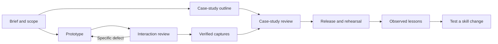

# Design Delivery Skills

[View the showcase](https://cellfade.github.io/design-delivery-skills/)

**Turn a product brief into a working prototype and a case study people can understand.**

Three portable Agent Skills for designers working with Codex or Claude Code. Frame the problem, demonstrate a complete journey, test recovery, and explain the choices with evidence.

Early release: the skills are extracted from real project work. Their packaging is checked; effectiveness across new projects and models is not yet benchmarked.

## Choose your starting point

| Skill | Use it for |
|---|---|
| [Design exercise workflow](skills/design-exercise-workflow/SKILL.md) | Brief, scope, coordination, release and rehearsal |
| [Interaction prototype](skills/interaction-prototype/SKILL.md) | Working journeys, state changes, visible recovery and acceptance evidence |
| [Product case study](skills/product-case-study/SKILL.md) | Problem, decisions, evidence and a clear visual narrative |

## How it works



Review loops have budgets and stop conditions. This is a documented workflow, not a background agent service or an executable graph engine.

## Install locally

Requires Python 3 and Git. Clone this repository, inspect its contents, then run:

```sh
git clone https://github.com/cellfade/design-delivery-skills.git
cd design-delivery-skills
python3 scripts/install.py --target both
```

This copies the skills into the documented personal directories for Codex and Claude Code. Existing differing skills are never overwritten. Use `--target codex` or `--target claude` for one host. For a reviewed update, use `--update`; the previous managed version is backed up. Start a fresh session to check discovery.

Codex: invoke `$design-exercise-workflow`. Claude Code: invoke `/design-exercise-workflow`. The two specialist skills can be used independently. Local installation does not install skills into ChatGPT, Claude.ai or Cowork account settings. Cloud sessions need access to this repository and their own installation or supported project-skill setup.

## Product imagery, included as an optional companion

The [SaaS Imagery Suite](integrations/saas-imagery-suite) is pinned as a Git submodule. It supplies product imagery, persona imagery and a brand-direction skill plus its runtime. The core three skills work without it.

```sh
git submodule update --init integrations/saas-imagery-suite
sh integrations/saas-imagery-suite/install.sh --target claude --scope user --dry-run
```

Review the destinations, then omit `--dry-run` to install. Use `--target codex` for Codex. The companion installer backs up existing skills; it is separate from the core installer. Keep an existing newer local suite unless an update is intended.

Workflow: verify prototype → capture accurate UI → agree art direction → generate product imagery → inspect fidelity and readability → place and test in the case study. See [imagery integration](docs/imagery.md).

## Example directions

Earlier product design work informed these practices. Public examples will use approved, generalized visuals. No client screenshots, company names, logos or identifying data are bundled as showcase assets. No claim is made that this new release generated the earlier projects.

## Improve it with evidence

Use the [learning protocol](docs/learning.md) to capture an observed failure, add a realistic regression case, compare a candidate change, and propose a small pull request. No unattended self-rewriting, scheduled runs, automatic merging or model training is enabled.

- [Research and architecture decisions](docs/research.md)
- [Workflow, handoffs and graph design](docs/workflow.md)
- [Evaluation scenarios](evals/scenarios.json)
- [Contribution guide](CONTRIBUTING.md)

## License

MIT for this repository's original skills, documentation and scripts. Referenced projects and third-party content retain their own terms.
